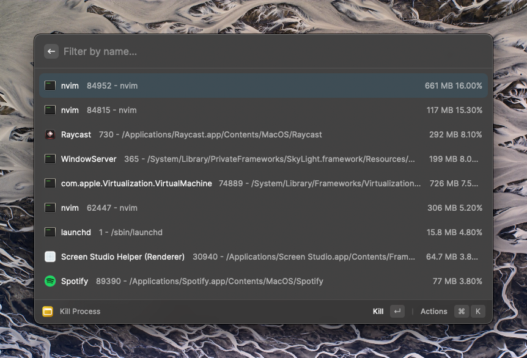

In this blog post, I will share with you some of the tools that I use to boost
my productivity on macOS. I will skip over the ones that most people already
knows about, such as [Homebrew](https://brew.sh/), or [Google Chrome](https://chromeisbad.com/)
(Just kidding, I will show you a better alternative), and I hope this post will
help you discover some new tools that you might find useful :)

## Table of Contents

## Raycast

Raycast is probably the first thing I will install on a Mac. It offers a similar
experience to the default Spotlight, but it is much more powerful than that.

Some of the features I use the most besides launching apps are:

- Raycast AI
- Clipboard History
- Kill Process
- Find files, Launch Google Meet, Search TailwindCSS docs, Add Linear issues,
  Toggle Spotify, Lookup words with dictionary, Calculator, Translator...
- You get the idea, you can almost always find a Raycast extension each app you use.

I will go over some of them in a bit more detail...

### Raycast AI

I like Raycast AI because it gives me **instant** access to GPT with just a
keyboard shortcut with **0 interruption** of my workflow.

I do not have to first open up my browser, navigate to chat.openai.com, then
realize my auth has expired so I need to sign in again... You get the idea, by
doing all of these it completely interrupts one's thought process / flow.

For example:

With Raycast AI, I can be sure I will be able to get a response within 10 seconds.

### Clipboard History

Being able to see all your clipboard history is simply amazing.

Remember the time when you need to copy multiple code snippets from the docs page
to your project and you are constantly navigating back and forth from your editor?
Have you ever tried finding a link or a command you copied yesterday?

With the clipboard history feature, all your clipboard history will be saved and
you can easily access them, search through them with a keyboard shortcut.

### Kill Process

As the name suggests, this feature allows you to quickly search through your
current running processes and killing the ones you want.

You can find more Raycast extensions from the [Raycast Store](https://www.raycast.com/store).

To learn more about Raycast -> [raycast.com](https://raycast.com) (not affiliated)

## Arc

Arc is probably the first tool I will install after Homebrew.

https://arc.net/gift/1f9c395b

## AdGuard

## 1Password

## Rectangle

## CleanShot X

## Screen Studio

## LazyVim

## LazyGit
